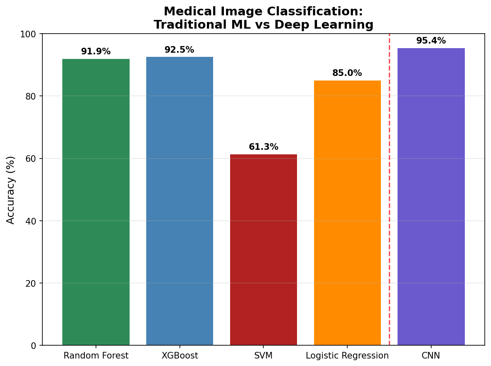
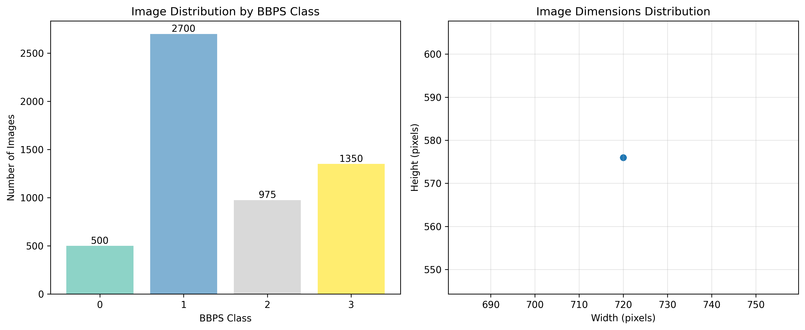
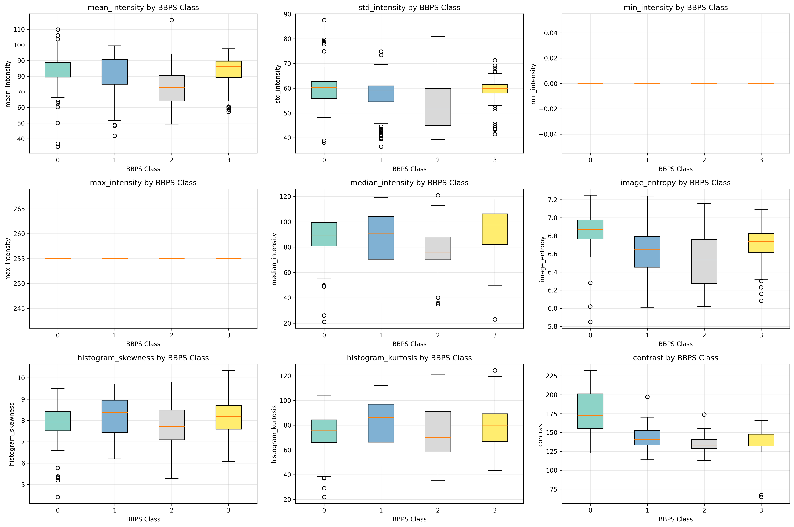
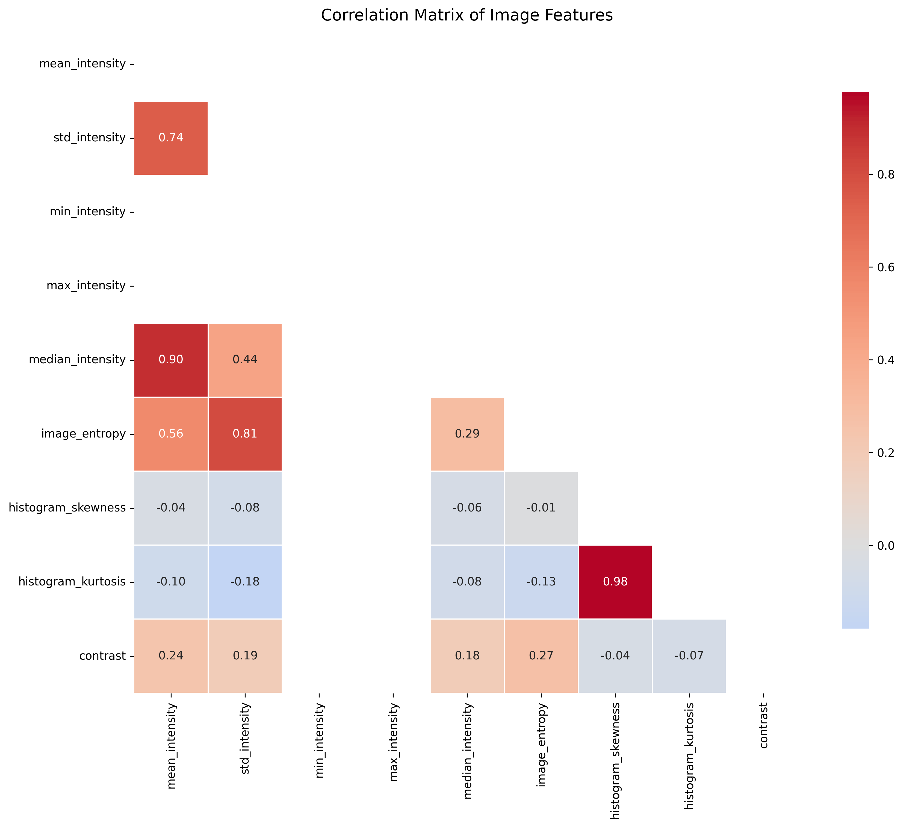
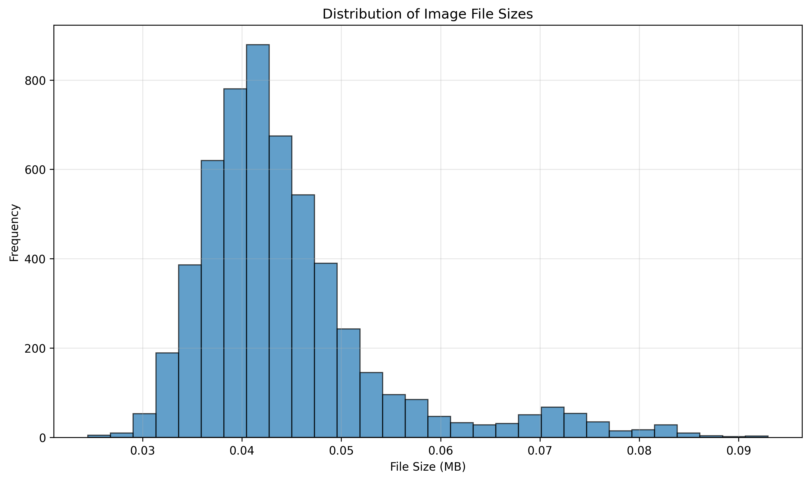
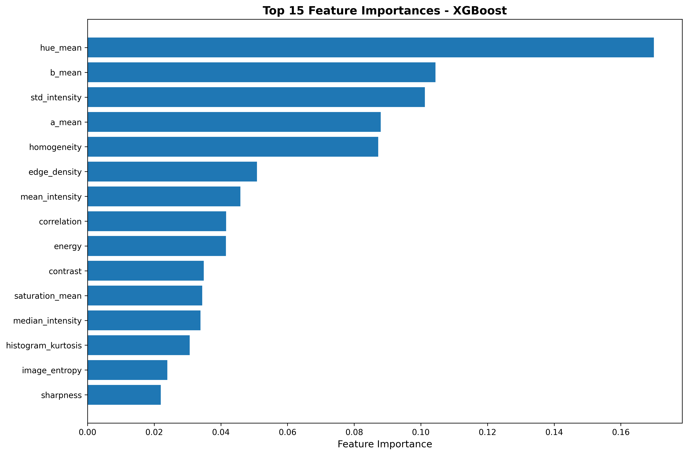
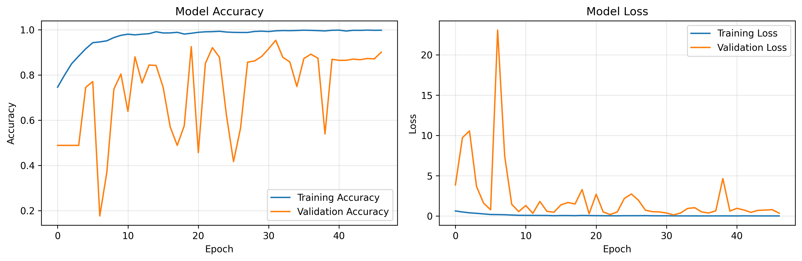

# Nerthus Medical ML 🏥🤖

A comprehensive machine learning and deep learning pipeline for automated bowel preparation quality assessment using the **Nerthus dataset**.  
This project demonstrates advanced skills in medical image analysis, traditional ML, deep learning, and production-ready Python development.



---

## 🎯 Project Overview
This project tackles the challenging problem of **automated bowel preparation quality assessment** from colonoscopy images.  
Bowel preparation quality directly impacts colonoscopy effectiveness and cancer detection rates.  
The system uses both traditional machine learning and deep learning approaches to classify images according to the **Boston Bowel Preparation Scale (BBPS)** scores 0–3.

---

## Dataset overview
The Nerthus dataset contains 5,525 colonoscopy images organized by BBPS scores.


### Feature analysis


### Feature correlations


### File size distribution


---

## 🏆 Key Achievements
- 🤖 **95.4% accuracy** with CNN learning from raw pixels  
- 🥇 **92.5% accuracy** with XGBoost using handcrafted features  
- Comprehensive comparison of traditional ML vs deep learning  
- Production-ready Python package architecture  
- Robust validation with cross-validation and overfitting analysis  

---

## 📊 Results Summary

### Performance Comparison
| Method | Architecture | Accuracy | Key Insight |
|--------|---------------|-----------|--------------|
| CNN | Raw pixels learning | **95.4% 🥇** | Best performance |
| XGBoost | Gradient boosting | 92.5% | Strong alternative |
| Random Forest | Handcrafted features | 91.9% | Promising end-to-end learning with domain-specific features |
| Logistic Regression | Linear model | 85.0% | Good baseline performance |

### Feature Importance
Top 15 most predictive features for bowel preparation quality:



- `hue mean` - Average hue in HSV color space
- `b mean` - Position between blue and yellow
- `std intensity` - Std image intensity
- `a mean` - Position between red/magenta and green
- `homogeneity` - Texture homogeneity (GLCM)

---

## 🏗️ Project Architecture

```
├── AUTHORS.txt                             # Author(s)
├── examples
│   ├── nerthus_cnn_champion.py
│   ├── nerthus_cnn_improved.py
│   ├── nerthus_cnn_simple.py
│   ├── nerthus_cnn_tuning.py
│   ├── nerthus_comparison_plot.py
│   ├── nerthus_image_analyzer.py
│   ├── nerthus_image_processor.py
│   └── nerthus_ml_pipeline.py
├── nerthus
│   ├── analyzer.py                         # Data analysis & EDA
│   ├── cli.py                              # Command line interface
│   ├── cnn.py                              # Deep learning
│   ├── __init__.py
│   ├── ml.py                               # Traditional ML
│   ├── processor.py                        # Image processing
│   └── utils.py                            # Utilities
├── pyproject.toml                          # Modern Python packaging
├── README.md                               # Project description
├── report
│   ├── images                              # Visualization files
│   ├── Makefile                            # Building the report
│   ├── Report.pdf                          # Report PDF file
│   ├── Report.tex                          # Report LateX file
│   └── requirements.sh                     # Prerequisites for the report
├── requirements.txt                        # Python project requirements
├── setup.py                                # Setup file
└── web
    ├── app.py                              # Web app file
    ├── debug_cnn.py                        # CNN debug file
    ├── loader.py                           # Model loader
    ├── requirements.txt                    # Web app requirements
    ├── run.py                              # Run web app with Python
    ├── static                              # Static file for the web app
    └── utils.py                            # Web app utilities
```


---

## 🚀 Quick Start

### Installation
```bash
# Clone the repository
git clone https://github.com/kvernet/nerthus-medical-ml.git
cd nerthus-medical-ml

# Install in development mode
pip install -e .

# Or install dependencies directly
pip install -r requirements.txt
```

### Basic Usage
```python
from nerthus import NerthusAnalyzer

# Initialize and run complete analysis
analyzer = NerthusAnalyzer()
analyzer.load_data()  # Auto-downloads from Kaggle
analyzer.analyze_image_features(sample_size=100)
analyzer.generate_report(sample_size=100, images_per_class=4)
```

### Command Line Interface
```bash
# Image processing
nerthus --processor (nerthus-processor --help)

# Analysis only
nerthus --analysis (nerthus-analysis --help)

# Complete ML pipeline (run analysis first)
nerthus --ml (nerthus-ml --help)

# CNN training
nerthus --cnn (nerthus-cnn --help)

# CNN training
python examples/nerthus_cnn_champion.py

# Performance comparison
python examples/nerthus_comparison_plot.py
```

---

## Visualization of CNN training results


---

## 📈 Key Features

### 🔬 Medical Image Analysis
- 22 handcrafted features specifically designed for medical images  
- Texture analysis using GLCM (contrast, homogeneity, energy, correlation)  
- Color space analysis in RGB, HSV, and LAB spaces  
- Edge detection and sharpness measurement  
- Blob detection for potential polyp identification  

### 🤖 Machine Learning Pipeline
- Multiple classifiers: Random Forest, XGBoost, SVM, Logistic Regression  
- Robust validation: 5-fold cross-validation with stratified sampling  
- Feature importance analysis and statistical significance testing  
- Overfitting detection with train-test performance gaps  
- Comprehensive reporting with confusion matrices and metrics  

### 🧠 Deep Learning
- Custom CNN architecture optimized for medical images  
- Data augmentation with rotation, shifting, and flipping  
- Learning rate scheduling and early stopping  
- CPU/GPU compatible with automatic fallback  
- Transfer learning ready architecture  

### 📊 Visualization & Reporting
- Dataset overview with class distributions and image statistics  
- Feature correlation heatmaps and distribution plots  
- Training history visualization for deep learning  
- Model comparison with professional-grade plots  
- Medical insights and deployment recommendations  

---

## 🏥 Medical Context

### Boston Bowel Preparation Scale (BBPS)
| Class | Description |
|--------|--------------|
| 0 | Unprepared colon, mucosa not visible due to solid stool |
| 1 | Portions of mucosa visible, but other areas not well seen |
| 2 | Minor residue, but mucosa clearly visible |
| 3 | Entire mucosa clearly visible |

### Clinical Significance
- Bowel preparation quality affects **adenoma detection rate by 20–50%**  
- Automated assessment reduces inter-observer variability  
- Standardized scoring improves screening program quality  
- Real-time feedback enhances colonoscopy effectiveness  

---

## 🔧 Technical Implementation

### Feature Engineering
```python
features = {
    'texture': ['contrast', 'homogeneity', 'energy', 'correlation'],
    'color': ['hue_mean', 'saturation_mean', 'l_mean', 'a_mean', 'b_mean'],
    'edges': ['edge_density', 'sharpness'],
    'intensity': ['mean_intensity', 'std_intensity', 'min_intensity', 'max_intensity'],
    'advanced': ['image_entropy', 'lbp_entropy', 'blob_count']
}
```

### CNN Architecture Summary
```
Model: "sequential"
=================================================================
Layer (type)                 Output Shape              Param #
-----------------------------------------------------------------
conv2d (Conv2D)              (None, 148, 148, 16)      448
max_pooling2d (MaxPooling2D) (None, 74, 74, 16)        0
conv2d_1 (Conv2D)            (None, 72, 72, 32)        4640
max_pooling2d_1 (MaxPooling2D) (None, 36, 36, 32)      0
conv2d_2 (Conv2D)            (None, 34, 34, 64)        18496
max_pooling2d_2 (MaxPooling2D) (None, 17, 17, 64)      0
flatten (Flatten)            (None, 18496)             0
dense (Dense)                (None, 64)                1183808
dropout (Dropout)            (None, 64)                0
dense_1 (Dense)              (None, 4)                 260
=================================================================
Total params: 1,207,652
Trainable params: 1,207,652
```

---

## 📋 Dataset Information
- **Source:** Nerthus Dataset on Kaggle  
- **Total Images:** 5,525 colonoscopy frames  
- **Classes:** 4 BBPS scores (0, 1, 2, 3)  
- **Resolution:** Standardized to 150×150 for CNN  
- **License:** Research use, citation required  

---

## 🎯 Skills Demonstrated
### 🐍 Advanced Python
- Class-based architecture and modular design  
- Type hints, docstrings, and exception handling  
- CLI development with `argparse`  

### 📊 Data Science & ML
- Feature engineering, cross-validation, and model interpretation  
- ANOVA testing and statistical validation  
- Visualization of metrics and performance  

### 🏥 Medical AI
- Understanding of gastroenterology domain  
- Medical image processing techniques  
- Clinical validation and interpretability considerations  

### 🚀 Software Engineering
- Unit tests and configuration management  
- Version control best practices  
- Documentation and usage examples  

---

## 🔮 Future Enhancements
- Transfer Learning with pre-trained models  
- Ensemble ML + DL hybrid approaches  
- Real-time inference API for clinics  
- Multi-center dataset validation  
- Explainable AI for clinical interpretability  

---

## 📚 Citation
```bibtex
@inproceedings{Pogorelov:2017:NBP,
  author = {Pogorelov, Konstantin and Randel, Kristin Ranheim and de Lange, Thomas and Eskeland, Sigrun Losada and Griwodz, Carsten and Johansen, Dag and Spampinato, Concetto and Taschwer, Mario and Lux, Mathias and Schmidt, Peter Thelin and Riegler, Michael and Halvorsen, P{a}l},
  title = {Nerthus: A Bowel Preparation Quality Video Dataset},
  booktitle = {Proceedings of the 8th ACM on Multimedia Systems Conference},
  year = {2017},
  pages = {170--174}
}
```

---

## 🤝 Contributing
1. Fork the repository  
2. Create a feature branch (`git checkout -b feature/amazing-feature`)  
3. Commit changes (`git commit -m 'Add amazing feature'`)  
4. Push to branch (`git push origin feature/amazing-feature`)  
5. Open a Pull Request  

---

## 📄 License
This project is licensed under the **MIT License**.

---

## 🆘 Support
For questions or issues:
- Open an issue on GitHub  
- Contact: `kinson.vernet@gmail.com`

---

## 🙏 Acknowledgments
- Kaggle for hosting the Nerthus dataset  
- Walter van Huissteden et al. for dataset creation  
- TensorFlow/Keras and Scikit-learn teams for core libraries  

---

<div align="center">

### Built with ❤️ for medical AI research  
If this project helps your research, please give it a ⭐!

</div>
